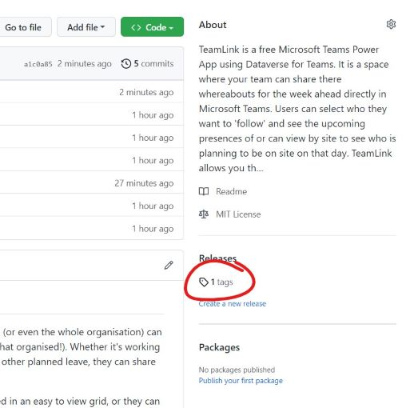
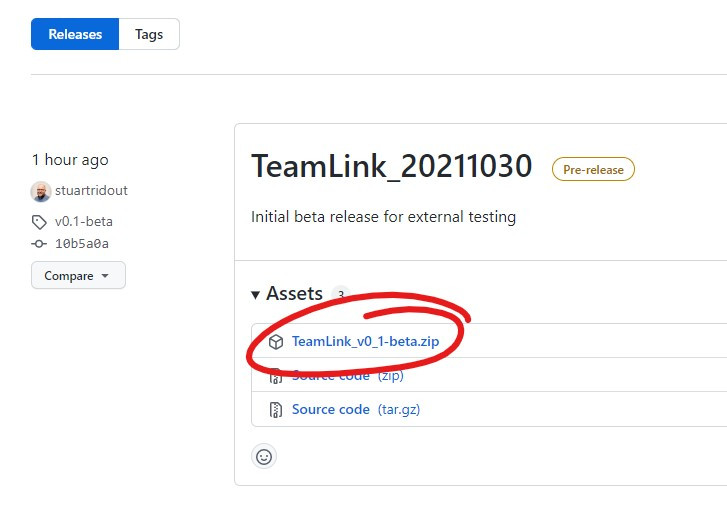
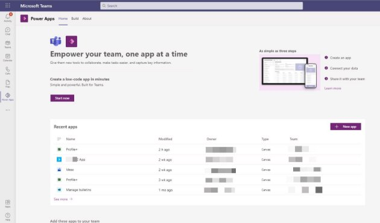
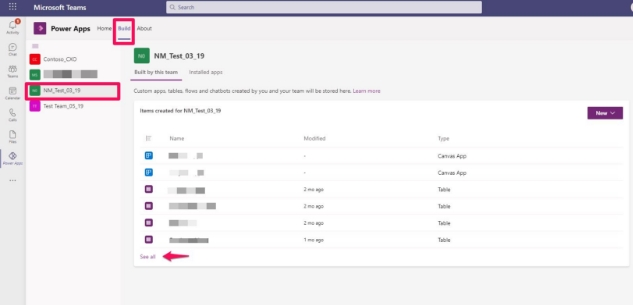
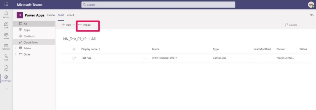
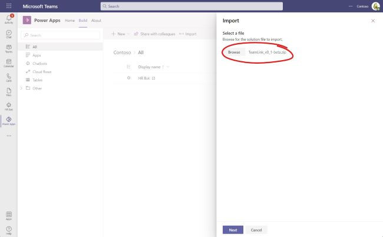
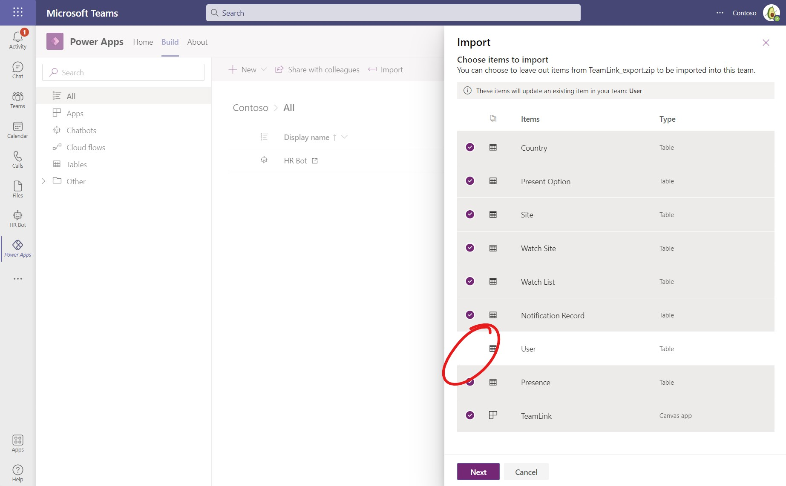

# Import TeamLink as an unmanaged solution into Dataverse for Teams environment 

This document provides instructions on how to add the components of TeamLink app in a *Dataverse for Teams* environment as an unmanaged solution.  

## Contents 

1. [Download the unmanaged Solution file](images/#p1)
1. [Import the solution in Dataverse for Teams](images/#p2)
---

## Download the managed Solution file

1. Browse to the Releases section of github repository 

   

1. Review the assets for latest release and download the ‘TeamLink\<Version>.zip’ file 

   

## Import the solution in Dataverse for Teams

1. Open Teams. Go to the Power Apps app within Teams (Install the app from Teams app store if needed) 

   

1. Browse to the Teams team environment where you’d like to import the solution. Select See All. 

   

1. Click the “Import” button. 

   

1. Browse to the Dataverse Solution file downloaded in [Download the unmanaged Solution file](images/#p1) step and click Next. 

   

1. Select the components you want to import (recommended you select all) and click on Import 

   

The import process will start in background.
