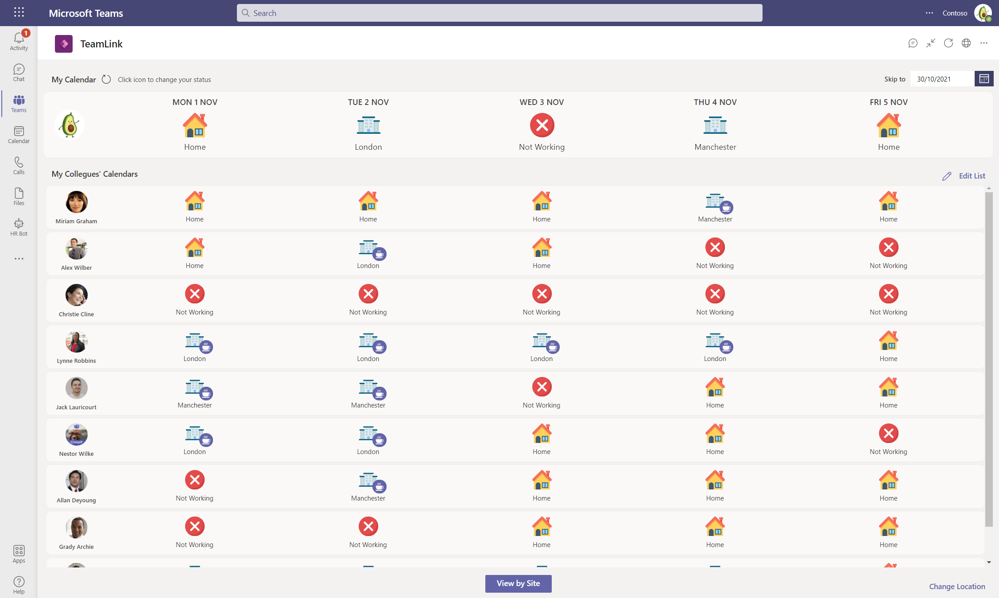

### We are seeing some challenges in non-GMT/UTC timezones - we're looking at this and will update this message when patched ###

## Overview

With the TeamLink app, you get a space in Microsoft Teams where your team (or even the whole organisation) can share their whereabouts for the coming weeks, months or further (if they're that organised!).  Whether it's working from home, one of your offices or not working e.g. vacations, not working or other planned leave, they can share this with a click of a button.

Users can choose which team members they 'follow' with their location shared in an easy to view grid, or they can view by office or site to see all users who are planning to be working there. You can even quickly send a message in Microsoft Teams to arrange a meet up by clicking the coffee icon.

TeamLink is a Teams application built on the [Dataverse for Teams](https://powerapps.microsoft.com/en-us/blog/reshape-the-future-of-work-with-microsoft-dataverse-for-teams-now-generally-available/) on the Power Platform. Once installed, it can be [customized and extended](https://docs.microsoft.com/en-us/powerapps/teams/customize-sample-apps) by the installer of the application.

## Installing

Detailed documentation for installation can be found in the [Documents](https://github.com/stuartridout/teamlink/tree/main/Documentation) folder to install the app as a managed solution in Microsoft Teams. 

**_Recommended_: Install in Teams**

**This is the easiest and quickest method to get started with this app template.** The provisioning is fully automated once the process starts and may take upto 2 - 3 minutes. You will get the option to chose which Teams team you'd like to install this application in. Refer to these [easy step-by-step instructions](https://github.com/stuartridout/teamlink/tree/main/Documentation) on how to get started with TeamLink.

If this is the first Power Apps in the team, a new Dataverse for Teams environment will be provisioned, the app installed, automatically shared with all members of the team and tabbed to the channel you pick. You will be able to [edit the app](https://docs.microsoft.com/en-us/powerapps/teams/customize-sample-apps) after installation by going to the Power Apps app.

Note that this provisions the 'managed' solution in the Teams environment. This means that you can take advantage of any future updates being made to the application by reinstalling the application (follow same steps as original installation).

## Trademarks

This project may contain trademarks or logos for projects, products, or services. Authorized use of Microsoft 
trademarks or logos is subject to and must follow 
[Microsoft's Trademark & Brand Guidelines](https://www.microsoft.com/en-us/legal/intellectualproperty/trademarks/usage/general).
Use of Microsoft trademarks or logos in modified versions of this project must not cause confusion or imply Microsoft sponsorship.
Any use of third-party trademarks or logos are subject to those third-party's policies.
